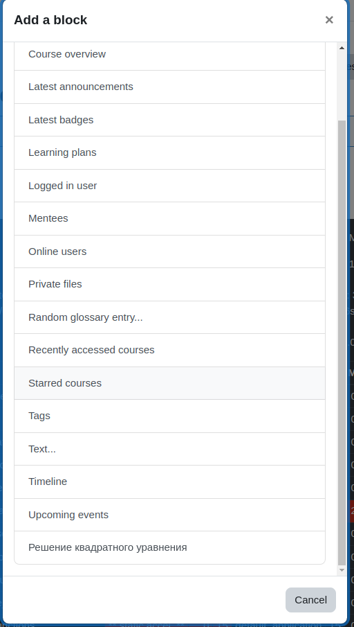
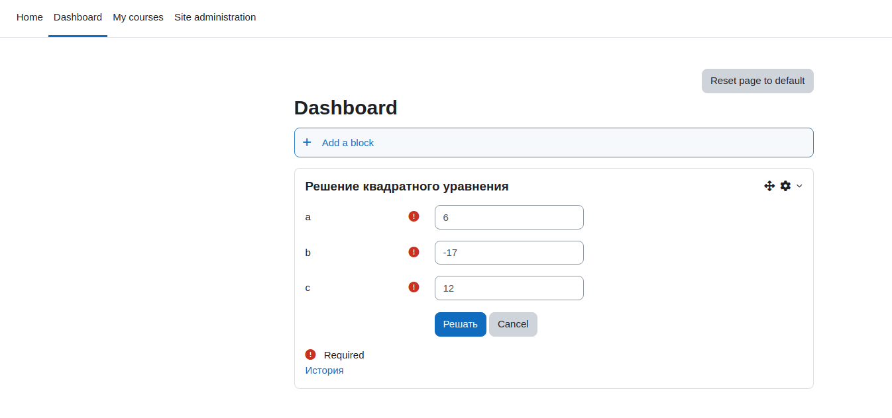
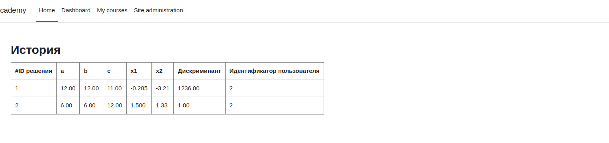

# Block plugin

# Как установить
1. git clone https://github.com/umarov-safar/moodle_plugin_quadratic.git your_folder
2. Перейдите в папку с плагином и создайте ZIP-архив
3. Установить плагин через Moodle:
   - Перейдите в раздел Site administration -> Plugins -> Install plugin
   - Нажмите кнопку Install plugin from ZIP file.
   - Загрузите созданный ZIP-файл плагина и наслаждайтесь

## Плагин в moodle
1. Добавить блок

2. Блок в странице

3. История
